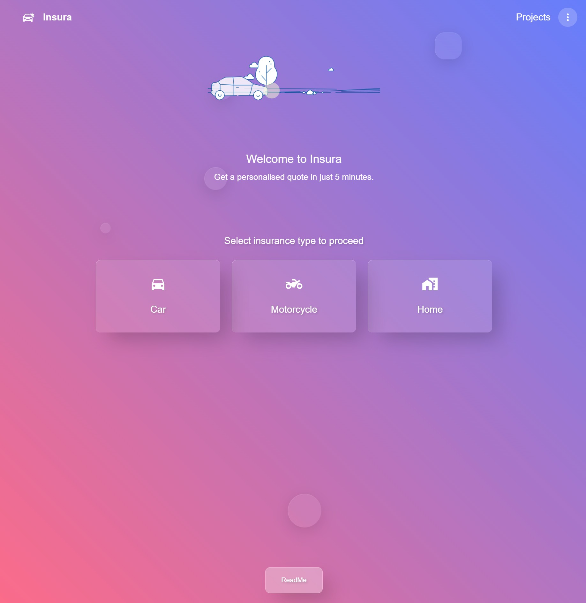
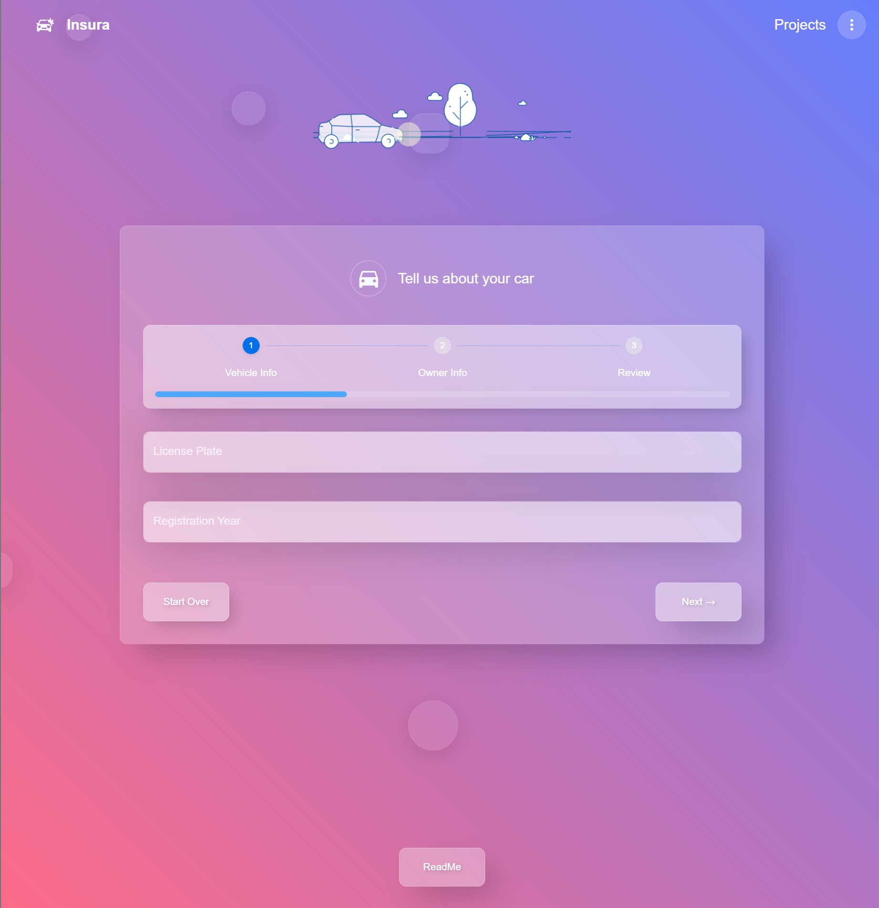

# Insura - Modern Insurance Quote Application

Insura is a sleek, user-friendly insurance quote application built with React and TypeScript. It offers a streamlined process for users to get personalized insurance quotes for vehicles (cars and motorcycles) and homes in just a few minutes.




## 🌟 Features

- **Multi-insurance Support**: Get quotes for car, motorcycle, and home insurance
- **Step-by-step Wizard**: Intuitive form wizard with progress tracking
- **Modern UI**: Glass-morphism design with blur effects and smooth transitions
- **Form Validation**: Comprehensive validation for all input fields
- **Responsive Design**: Works seamlessly on all device sizes
- **State Management**: Efficient state management with Zustand
- **Type Safety**: Built with TypeScript for enhanced code reliability

## 🛠️ Technologies Used

- **React 19**: Latest version of React with improved performance
- **TypeScript**: For type safety and better developer experience
- **Material UI 7**: Component library for a consistent and beautiful UI
- **React Router 7**: For application routing
- **React Hook Form**: For efficient form handling and validation
- **Zustand**: Lightweight state management solution
- **React Markdown**: For rendering markdown content
- **Vite**: Fast build tool and development server

## 📂 Project Structure

```
react-to-insurance/
├── public/              # Static assets
├── src/
│   ├── components/      # Reusable UI components
│   │   ├── wizard/      # Wizard for different insurance types
│   │   │   └── steps/   # Individual step components for the wizards
│   ├── config/          # Configuration files
│   ├── layouts/         # Layout components
│   ├── pages/           # Page components
│   ├── store/           # Zustand store
│   ├── types/           # TypeScript type definitions
│   └── App.tsx          # Main application component
├── index.html           # HTML entry point
└── vite.config.ts       # Vite configuration
```

## 🚀 Development Journey

The development of Insura followed a structured approach:

1. **Initial Setup**: Set up the project with Vite, React, TypeScript, and Material UI
2. **Routing**: Implemented routing with React Router
3. **UI Design**: Created a modern glass-morphism design system
4. **Form Structure**: Designed the multistep wizard form structure
5. **State Management**: Implemented state management with Zustand
6. **Form Validation**: Added validation with React Hook Form
7. **Insurance Types**: Implemented specific forms for different insurance types
8. **Polishing**: Added animations, transitions, and improved UX
9. **Testing & Optimization**: Ensured the application works smoothly across devices

## 🏁 Getting Started

### Prerequisites

- Node.js (v18 or higher)
- npm or yarn

### Installation

1. Clone the repository:
   ```bash
   git clone https://github.com/Tsiroto/insura.git
   cd react-to-insurance
   ```

2. Install dependencies:
   ```bash
   npm install
   # or
   yarn
   ```

3. Start the development server:
   ```bash
   npm run dev
   # or
   yarn dev
   ```

4. Open your browser and navigate to `http://localhost:5173`

### Building for Production

```bash
npm run build
# or
yarn build
```

## 📬 Reach Me

### If you'd like to connect, collaborate, or just say hi, feel free to reach out:

- 📧 Email: doufasg@gmail.com
- 💼 LinkedIn: https://www.linkedin.com/in/georgios-ntoufas/
- 🐙 GitHub: [@Tsiroto](https://github.com/Tsiroto)

## 📄 License

This project is licensed under the MIT License—see the LICENSE file for details.